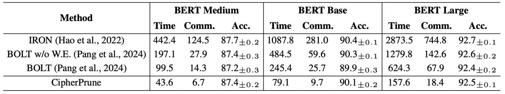
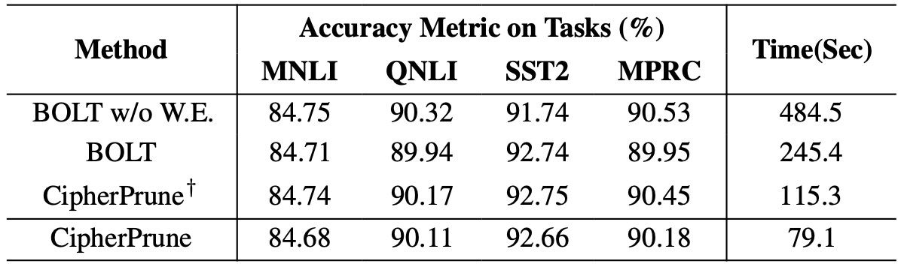
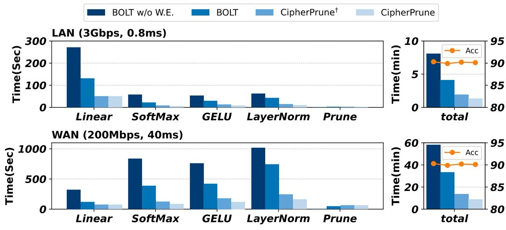

# CipherPrune: Efficient and Scalable Private Transformer Inference

This is the code for CipherPrune: Efficient and Scalable Private Transformer Inference. This code is built upon the [EzPC](https://github.com/mpc-msri/EzPC) library.

## Installation

Please follow the [EzPC](https://github.com/mpc-msri/EzPC) instructions to build and install the library.

## Test pruning

To test the secure pruning protocol, run the following command under the ```SCI/build/bin``` directoty. One token is a vector of length 768 by default. For example, to prune 4 tokens out of 55 tokens, run (role==1 means server).

    ./prune-OT r=1 N=50 pr=2

In another terminal run (role==1 means client):

    ./prune-OT r=2 N=50 pr=2

By successfully building the test files, on the server side you should see:

    connected
    All Base OTs Done
    [Multihead] 16 heads and N=50
    [Test] in prune
    [In prune] Time taken: 0.918475 seconds
    [In Prune] prune Time	528.661 ms
    Number of prune ops/s:	94.4415
    prune Time	529.428 ms
    prune Bytes Sent	3031806 bytes
    [Info] Called SCI_OT for Prune
    [Info] Vector Length is: 50
    [Server] Successful Operation

and on the client side, you should see:

    connected
    All Base OTs Done
    [Multihead] 16 heads and N=50
    [Test] in prune
    [In prune] Time taken: 0.900247 seconds
    [In Prune] prune Time	528.909 ms
    [Prune] Success mask!
    ================== res and shares ==================
    prune 2 out of 50
    Average ULP error: 0
    Max ULP error: 0
    Number of tests: 50
    Number of prune ops/s:	94.4615
    prune Time	529.316 ms
    prune Bytes Sent	4624846 bytes

## Reproducing the results
### End-to-end comparison.
The Table 1 is obtiained by running the implementation of IRON and BOLT in [BOLT's implementaion](https://github.com/Clive2312/BOLT). By building the BOLT's project, and run (in two terminals):
    
    ./bin/BOLT_WE_BERT r=1 && ./bin/BOLT_WE_BERT r=2

Similarly, to test IRON and BOLT w/o W.E., one can run:

    ./bin/BOLT_BERT r=1 && ./bin/BOLT_BERT r=2
and

    ./bin/IRON_BERT r=1 && ./bin/IRON_BERT r=2

After running, you should see the following results. A full log is provided in ```log/bert_we.log```.

    > [NETWORK]: Linear 1 consumes: 11105771 bytes
    > [NETWORK]: Linear 2 consumes: 9594432 bytes
    > [NETWORK]: Linear 3 consumes: 37787904 bytes
    > [NETWORK]: Linear 4 consumes: 9594432 bytes
    > [NETWORK]: Softmax consumes: 2835802560 bytes
    > [NETWORK]: GELU consumes: 4887429120 bytes
    > [NETWORK]: Layer Norm 1 consumes: 1827998259 bytes
    > [NETWORK]: Layer Norm 2 consumes: 1827997996 bytes
    > [NETWORK]: Tanh consumes: 8724480 bytes
    > [NETWORK]: Softmax * V: 9624892 bytes
    > [NETWORK]: Pruning: 113983584 bytes
    > [NETWORK]: Shift consumes: 668655616 bytes
    > [NETWORK]: gt_sub consumes: 1358362624 bytes
    > [NETWORK]: Pooling / C consumes: 310785796 bytes
    -> End to end takes: 108.013sec

CipherPrune reduces the number of token in each layer. We test the latency layer by layer. To test the GELU, LayerNorm and SoftMax function, run ```SCI/tests/bert_bolt/test_nonlinear.cpp```. Alternatively, run the tests provided in ```SCI/tests```. To test the SoftMax function for one attention module with 128 tokens and 12 heads (196608=128 * 128 * 12), run:

    ./bin/softmax-OT r=1 N=196608 && ./bin/softmax-OT r=2 N=196608

All non-linear functions are based exsiting works. After running, you should see:

    ➜  bin git:(master) ✗ ./softmax-OT r=2 N=196608
    connected
    All Base OTs Done
    Average ULP error: 5.08626e-06
    Max ULP error: 1.32265e-05
    Number of tests: 196608
    Number of softmax ops/s:	3764.44
    softmax Time	52227.6 ms
    softmax Bytes Sent	1538162762 bytes

CipherPrune requires running the token pruning protocol, in ```SCI/tests/test_ring_prune.cpp```. The token pruninng is also a non-linear operation. All non-linear functions are implemented in ```SCI/src/FloatingPoint/fixed-point.cpp```. In the token pruning protocol, the embedding dimension is set to 768 by default. To test the latency and communication, you need to specify the number of input tokens and the number of tokens to be pruned. More details are introduce in the "test pruning" part.

The number of tokens in each layer in CipherPrune is as follows:

    BERT-medium: 128-55-52-49-45-24-14-5
    BERT-base: 128-55-54-52-49-45-24-14-5-2-1-1
    BERT-large: 128-55-55-55-55-55-54-43-39-35-28-21-16-10-3-3-2-2-2-1-1-1-1-1



### Ablation
The BOLT w/o W.E. is obtained as above. BOLT prune half of the tokens. CipherPrune$^\dagger$ performs layer-wise pruning and prune more tokens. CipherPrune is computed by approximating half of the remaining tokens. The approximated tokens (with low-degree polynomials) have half of the runtime and communication compared to the high-degree counter parts.

BOLT w/o W.E., run:

     ./bin/BOLT_BERT r=1 && ./bin/BOLT_BERT r=2
BOLT, run

    ./bin/BOLT_WE_BERT r=1 && ./bin/BOLT_WE_BERT r=2
CipherPrune$^\dagger$, compute each part according to the number of tokens in each layer

    ./bin/gelu-OT r=1 N=$ops$ && ./bin/gelu-OT r=2 N=$ops$
    ./bin/softmax-OT r=1 N=$ops$ && ./bin/softmax-OT r=2 N=$ops$
    ./bin/layernorm-OT r=1 N=$ops$ && ./bin/layernorm-OT r=2 N=$ops$
    ./bin/prune-OT r=1 N=$input token number$ pr=$number of tokens to be pruned$ && ./bin/prune-OT r=2 N=$input token number$ pr=$number of tokens to be pruned$

The linear part is not modified (the same as BOLT). The time is approximated.

For Figure 9, the latency is approximated by changing the number of tokens in each layer.



### Runtime breakdown
As shown above, the runtime breakdown can be obtained by running:

    ./bin/BOLT_BERT r=1 && ./bin/BOLT_BERT r=2
and

    ./bin/IRON_BERT r=1 && ./bin/IRON_BERT r=2
and the results are shown as:

    > [TIMING]: linear1 takes 30.6224 sec
    > [TIMING]: linear2 takes 4.41976 sec
    > [TIMING]: linear3 takes 12.7736 sec
    > [TIMING]: linear4 takes 13.3999 sec
    > [TIMING]: softmax takes 4.9214 sec
    > [TIMING]: pruning takes 1.01455 sec
    > [TIMING]: mul v takes 13.7674 sec
    > [TIMING]: gelu takes 4.31445 sec
    > [TIMING]: ln_1 takes 5.35626 sec
    > [TIMING]: ln_2 takes 5.2959 sec
    > [TIMING]: tanh takes 0.124959 sec
    > [TIMING]: repacking takes 6.4047 sec
    > [TIMING]: gt_sub takes 3.7129 sec
    > [TIMING]: shift takes 1.39952 sec
    > [TIMING]: conversion takes 2.92423 sec
    > [TIMING]: ln_share takes 0.00225847 sec
    > [TIMING]: Pool/Class takes 0.606833 sec
    -> End to end takes: 108.013sec

CipherPrune$^\dagger$ removes more tokens. CipherPrune is computed by approximating half of the remaining tokens.



Figure 11 is obtained by running ```SCI/tests/test_ring_prune.cpp``` in between different layers. For example, in the 5-th layer of BERT base, run:

    ./prune-OT r=1 N=49 pr=4 && ./prune-OT r=2 N=49 pr=4